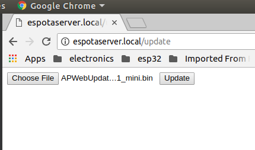

# ESP8266_ARDUINO_AP_OTA
I was looking for Arduino code examples for OTA updates of ESP8266 sketches with the unit set up as AP only. 
The existing examples were using AP+STA mode which didn't work for me. I wanted to be able to
update units in the field from a laptop or smartphone without having the ESP8266 connect to an existing WiFi network first.

I started tinkering with the Arduino Examples->ESP8266HTTPUpdateServer->WebUpdater sketch and finally got it working. The trick 
seems to be to disconnect station mode first before setting up as access point.

## Test Configuration
* Arduino 1.8.5 with esp8266 package ver 2.4.1,  Ubuntu 18.04 LTS, Chrome web browser
* Wemos D1 mini board

## Steps 
Compile and upload the APWebUpdater.ino sketch to your ESP8266 module via the standard USB-UART interface. 

Reset or power-cycle the board after uploading, even if you see the reboot messages in the serial monitor.
This is important. If you forget, you will later see an OTA update failure message about a bootstrap problem 
and a prompt to reset the board. 

In the example code, the access point is named EspAccessPoint with no access password. Connect to this access point. 

Open your web browser
and enter the url http://espotaserver.local/update (or http://192.168.4.1/update). You should see the httpupdate server webpage with a button to choose the firmware binary to upload.

Go back to the Arduino sketch. In the loop() method, enable the code to blink the led by changing #if 0 to #if 1.
Now navigate to the Arduino menu "Sketch->Export compiled Binary". This will compile the sketch and export the compiled binary file to your Arduino sketch folder.

Go back to the ota server webpage, click on "Choose file", and select the new binary file in your sketch folder.

After uploading the file, click on the "update" button in the webpage.

You'll eventually see a webpage acknowledgement of upload success, and the ESP8266 will reboot with the new firmware. You will see the led blinking now.
