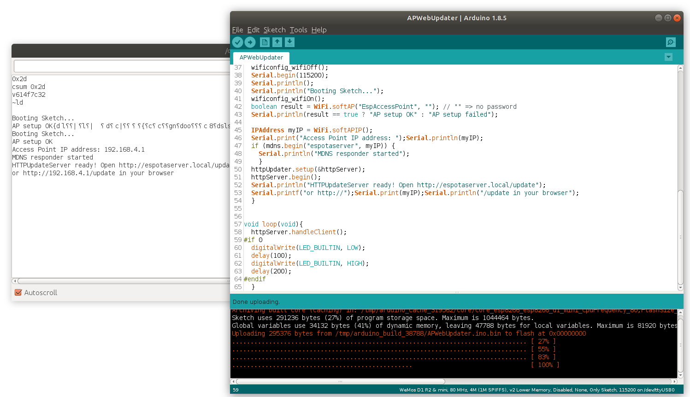

# ESP8266_ARDUINO_AP_OTA
I was looking for Arduino code examples for OTA updates of ESP8266 sketches with the unit set up as AP only. 
The existing examples were using AP+STA mode which didn't work for me. I wanted to be able to
update units in the field from a laptop or smartphone without having the ESP8266 connect to an existing WiFi network first.

I started tinkering with the Arduino Examples->ESP8266HTTPUpdateServer->WebUpdater sketch and finally got it working. The trick 
seems to be to disconnect station mode first before setting up as access point.

## Steps 
Compile and upload the APWebUpdater.ino sketch to your module via the standard USB-UART interface. 
In my example, I am using a Wemos D1 mini board.

Remember to reset or power-cycle the board after uploading, even if you see the reboot messages in the serial monitor.
This is important, if you forget, you will later see a failure message during the OTA update about a bootstrap problem 
and a prompt to reset the board. 

In the code, the access point is named EspAccessPoint with no access password. Connect to this access point. Open your web browser
and enter the url http://espotaserver.local/update (or http://192.168.4.1/update).

You should see the httpupdate server webpage with a prompt to select the firmware binary to upload.

Go back to the Arduino sketch. In the loop() method, enable the code to blink the led by changing #if 0 to #if 1.
Now select the Arduino menu "Sketch->Export compiled Binary". This will export the compiled binary file to your Arduino
sketch folder.

Go back to the ota server webpage, select the binary file, and hit upload.

You'll eventually see an acknowledgement of upload success, and the new firmware should start running and you will see
the led blinking.
